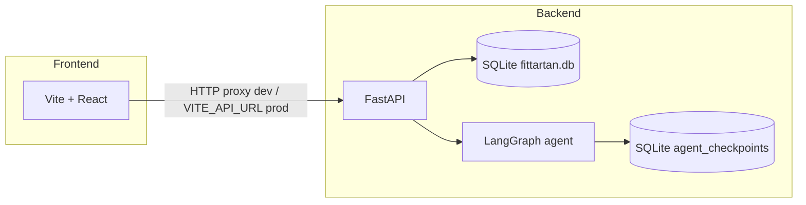

# FitTartan

FitTartan is a campus-oriented web app that combines **training logs**, **nutrition tracking**, **CMU dining–aware meal ideas**, **gym crowd timing**, and an **AI assistant** (Anthropic + LangGraph) in one place. The product copy describes it as tuned for a healthy life on campus—nutrition targets, weekly trends, and quieter gym windows.

**Repository:** [github.com/sumreenf/FitTartan](https://github.com/sumreenf/FitTartan)

---

## Features

| Area | What it does |
|------|----------------|
| **Onboarding & profile** | Create a user with weight, goal, activity level, dietary notes, and optional biometrics (age, height, sex) for BMR/TDEE-style targets. |
| **Nutrition** | Log foods, see calorie/macro progress against targets, dining menu context, and meal suggestions. |
| **Training** | Log workouts (exercise, sets, reps, optional weight), view balance across the week, and use crowd-aware timing hints. |
| **Chat** | Ask the agent about meals, workouts, gym quiet times, and weekly summaries; responses can include structured UI cards (meal combos, cook-at-home options, gym windows). |
| **Weekly** | Streaks, trends, and charts built from logs and summaries. |
| **Crowd** | Record gym check-ins and query estimated quieter windows per location. |
| **Dining data** | On API startup, the backend syncs a cache of **CMU dining** menu items (scraped HTML + USDA macro enrichment when configured). |

---

## Architecture



- **Frontend:** React 18, React Router, Tailwind CSS, Recharts, Axios. Dev server proxies API paths to the local FastAPI instance.
- **Backend:** FastAPI, SQLAlchemy, SQLite (`./fittartan.db` relative to the backend working directory), LangGraph with **SQLite checkpointer** (`agent_checkpoints.sqlite` next to `agent.py`).
- **External services:** Anthropic API (chat agent), USDA FoodData Central (optional macro enrichment for scraped menu labels).

---

## Repository layout

```
fittartan/
├── package.json          # Root: dev/build scripts delegate to frontend/
├── README.md
├── backend/
│   ├── main.py           # FastAPI app, CORS, lifespan (init DB + menu sync)
│   ├── database.py       # Models, engine, migrations helpers
│   ├── agent.py          # LangGraph + checkpoint DB
│   ├── scraper.py        # CMU dining scrape + USDA enrichment
│   ├── routers/          # users, logs, agent, crowd, content, eval
│   ├── requirements.txt
│   ├── Procfile          # e.g. Railway: uvicorn on $PORT
│   └── .env.example
└── frontend/
    ├── vite.config.js    # Dev proxy → http://127.0.0.1:8000
    ├── vercel.json       # SPA rewrites for static hosting
    ├── package.json
    └── src/              # App, pages, components, api.js
```

---

## Prerequisites

- **Node.js** 18+ (for Vite / npm)
- **Python** 3.11+ recommended (for FastAPI and dependencies)

---

## Quick start (local)

### 1. Clone and install

```bash
git clone https://github.com/sumreenf/FitTartan.git
cd FitTartan

# Frontend
cd frontend && npm install && cd ..

# Backend (virtualenv recommended)
cd backend
python -m venv .venv
source .venv/bin/activate   # Windows: .venv\Scripts\activate
pip install -r requirements.txt
cd ..
```

### 2. Environment variables

**Backend** — copy `backend/.env.example` to `backend/.env` and set:

| Variable | Required | Purpose |
|----------|----------|---------|
| `ANTHROPIC_API_KEY` | Yes (for chat) | Anthropic API key for the LangGraph agent. |
| `USDA_API_KEY` | No | [FoodData Central](https://fdc.nal.usda.gov/api-key-signup.html) API key; improves macro estimates for scraped dining labels. If unset, scraping still runs with fallbacks/mock data where implemented. |

**Frontend** — optional `frontend/.env`:

| Variable | Purpose |
|----------|---------|
| `VITE_API_URL` | **Production:** full origin of the API (e.g. `https://your-api.example.com`). **Development:** leave empty so the Vite dev server proxies to `http://127.0.0.1:8000`. |

### 3. Run the app

From the **repository root**:

```bash
npm run dev:all
```

This runs the Vite dev server and Uvicorn together (see `frontend/package.json` scripts). Alternatively:

- **Frontend only:** `npm run dev` (root) or `cd frontend && npm run dev`
- **Backend only:** `cd frontend && npm run api` *or* `cd backend && python -m uvicorn main:app --host 127.0.0.1 --port 8000 --reload`

Open the URL Vite prints (default **http://localhost:5173**). Complete **onboarding** first; the app stores `fittartan_user_id` in `localStorage` and routes signed-in views from there.

**Health check:** `GET http://127.0.0.1:8000/health` → `{"status":"ok"}`.

---

## npm scripts (root)

| Script | Action |
|--------|--------|
| `npm run dev` | Start Vite in `frontend/`. |
| `npm run build` | Production build of the frontend. |
| `npm run preview` | Preview the production build locally. |
| `npm run api` | Start FastAPI from `backend/` on port 8000. |
| `npm run dev:all` | Frontend + backend concurrently. |

---

## API surface (overview)

Routers are mounted on the FastAPI app; common prefixes include:

- **`/users`** — User CRUD / profile.
- **`/logs`** — Workout, weight, and food logs.
- **`/agent`** — `POST /agent/chat` (JSON or streaming) for the assistant.
- **`/checkin`**, **`/crowd/{gym}`** — Gym check-ins and crowd windows.
- **`/menu/today`**, **`/meals/suggestions/{user_id}`**, **`/summary/{user_id}`**, **`/motivation/daily`** — Menu cache, suggestions, weekly-style summary, daily motivation.
- **`/eval`** — Evaluation / experiment helpers (intended for development, not required for normal app use).

Exact request/response shapes are defined in `backend/routers/` and the Pydantic models there.

### CORS (production)

The backend reads **`CORS_ORIGINS`** (comma-separated list). Default if unset: `http://localhost:5173,http://127.0.0.1:5173`. Set this to your deployed frontend origin(s) when the API is hosted separately.

---

## Database and local files

- **`backend/fittartan.db`** — Main app database (created on first run via `init_db()`). Not committed to git (see `.gitignore`).
- **`backend/agent_checkpoints.sqlite`** (+ `-wal` / `-shm`) — LangGraph conversation checkpoint store. Also gitignored.

If you **reset** data for demos, see `backend/seed.py`: it recreates schema and seeds a demo user. **Stop the API server** before running seed, or SQLite may stay locked:

```bash
cd backend
source .venv/bin/activate   # if using venv
python seed.py
```

---

## Dining scraper behavior

On startup, `main.py` lifespan calls `sync_menu_to_db`. The scraper targets CMU dining locations defined in `scraper.py` (e.g. Resnik, Tepper Café, Entropy). Network failures or HTML changes are tolerated: operations can fall back so the API still starts.

---

## Deployment notes

- **Frontend static hosting (e.g. Vercel):** `frontend/vercel.json` rewrites unknown paths to `index.html` for client-side routing. Set **`VITE_API_URL`** at build time to your public API base URL.
- **Backend (e.g. Railway / Render):** `Procfile` runs `uvicorn main:app --host 0.0.0.0 --port $PORT`. Persist **`fittartan.db`** (and checkpoint DB if you need durable chat state) with a volume or managed storage—ephemeral filesystems lose data on redeploy.

---

## Contributing / development

- Match existing formatting and patterns in `frontend/src` and `backend/`.
- Do not commit **`.env`**, local **`.db` / `.sqlite*`**, or **`node_modules`**.
- Run the backend with reload during API work; use browser devtools or `curl` against `http://127.0.0.1:8000` for quick checks.

---

## Troubleshooting

| Symptom | Likely cause |
|---------|----------------|
| UI says it cannot reach the API on port **8000** | Backend not running, or wrong `VITE_API_URL` in dev (should be empty for proxy). |
| Chat errors after other features work | Missing or invalid **`ANTHROPIC_API_KEY`**. |
| `seed.py` exits with SQLite locked | Uvicorn or another process still has **`fittartan.db`** open. |
| Menu empty or stale | Scrape blocked or CMU page changed; check logs; mock/fallback paths may apply. |

---

## License

No license file is bundled in this repository yet. Add a `LICENSE` file when you decide how you want others to use the code.
